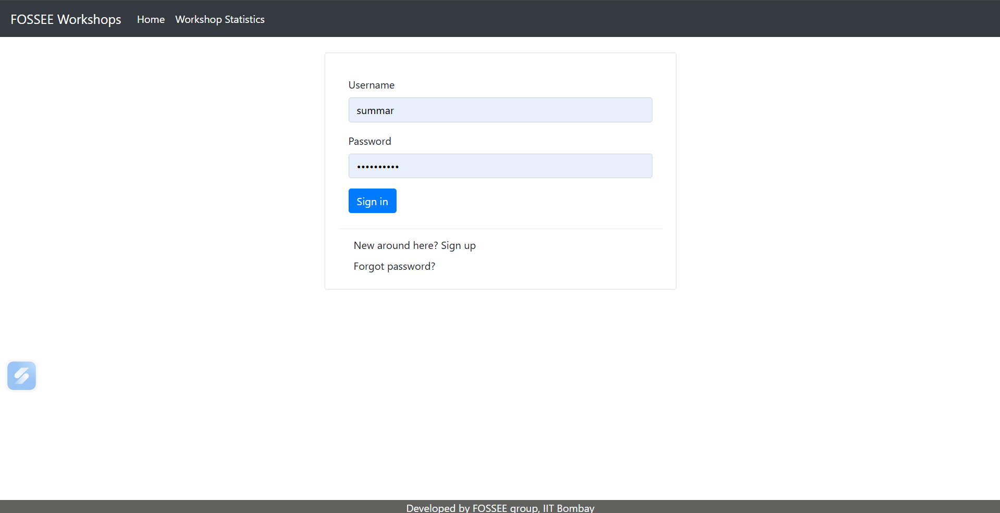
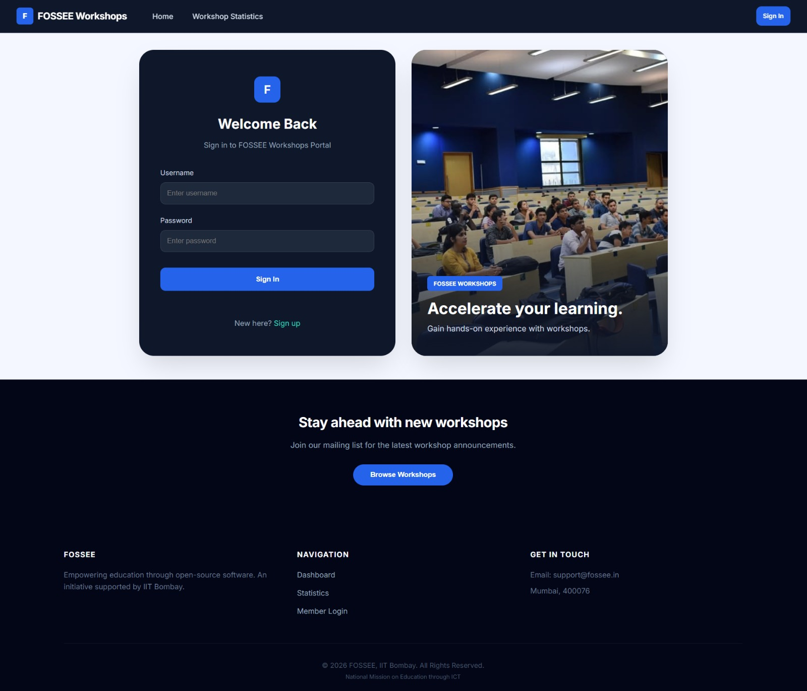
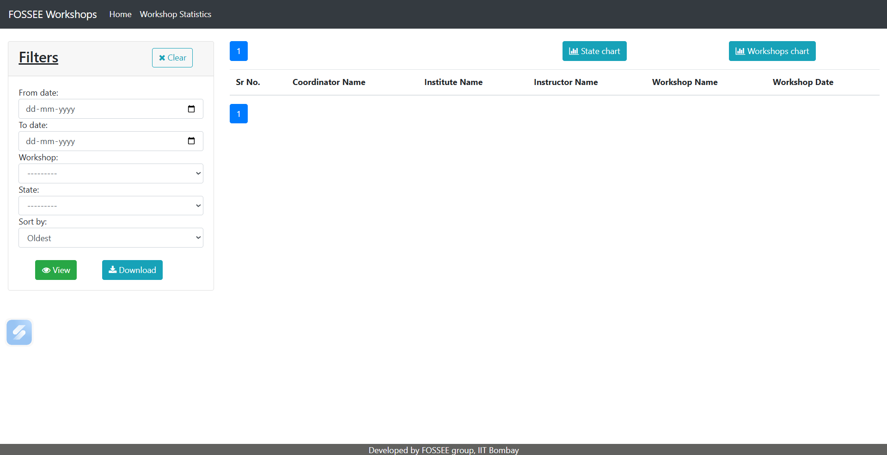
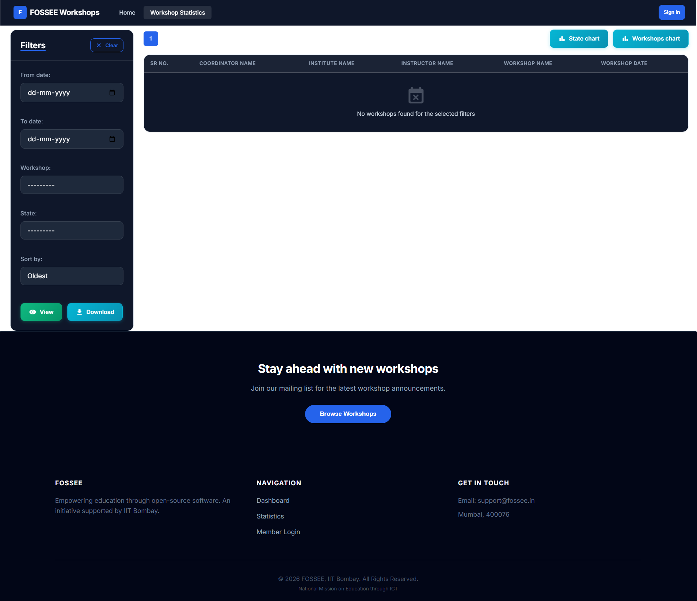
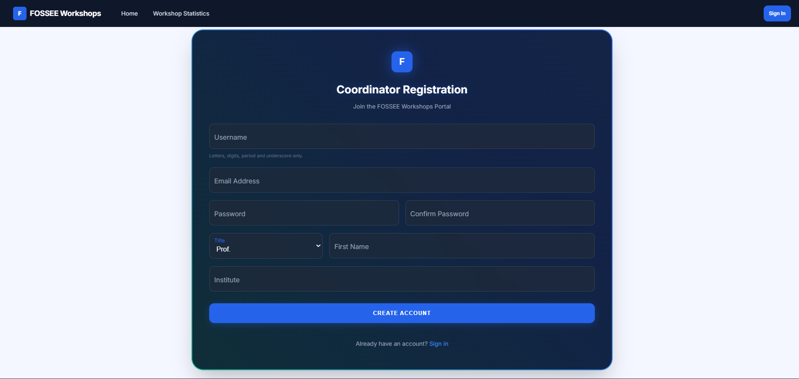
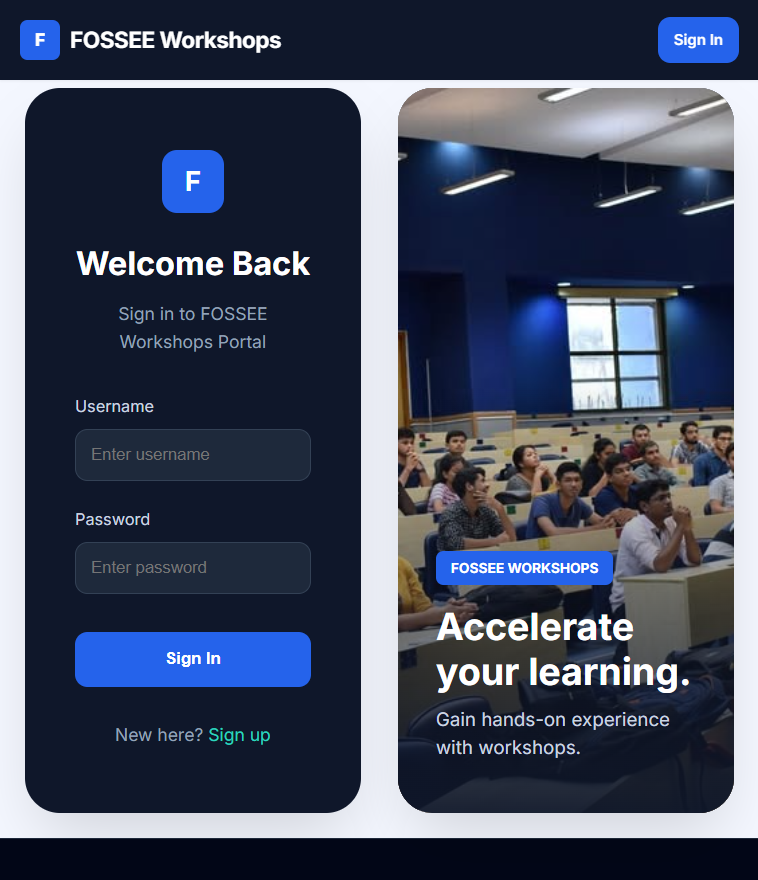
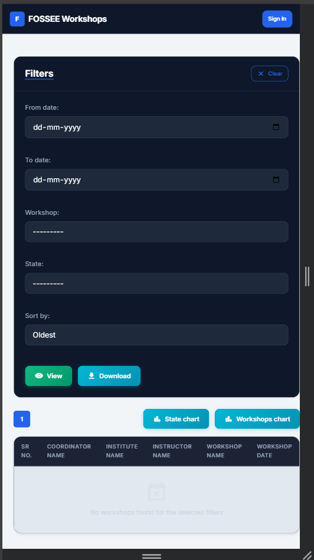

# 🎨 Python Screening Task: UI/UX Enhancement

## 📌 Overview
This project focuses on modernizing the UI/UX of the existing Workshop Booking platform provided by FOSSEE. The primary objective was to transform a traditional interface into a high-performance environment by enhancing usability, responsiveness, and visual depth while maintaining the core functionality of the application.

The redesign prioritizes clarity and accessibility through a modern "app-like" experience, specifically optimized for seamless navigation on both desktop and mobile devices.

---

## 🚀 Features & Improvements

### 🏠 Home & Login Experience
* **Modern Hero Section**: Introduced a dedicated landing page featuring clear call-to-action buttons to improve user onboarding and provide immediate project context.
* **Split-Screen Design**: Implemented an interactive split-screen layout on the login page, utilizing side visual panels for better branding and a professional aesthetic.
* **Glassmorphism**: Integrated a "Glass Card" effect for authentication forms using `backdrop-filter` and semi-transparent layers, providing a premium, high-contrast feel.
* **Seamless Visual Flow**: Eliminated "whitespace breakage" by ensuring a continuous dark gradient flows from the Navbar to the Footer, creating a unified single-pane experience.

### 📊 Workshop Statistics Page
* **Dashboard Layout**: Converted the standard layout into a professional dashboard-style UI featuring a dedicated sidebar filter panel for enhanced data accessibility.
* **Visual Hierarchy**: Refined table alignment and spacing to ensure that workshop data remains the focal point, even when viewing complex datasets.
* **Unified Theme**: Applied the dark-mode design system consistently across all charts and controls to ensure a cohesive user journey.

### 📝 Registration & Success Flow
* **Modern Card Architecture**: Replaced table-based forms with structured card layouts to improve readability and reduce user fatigue during data entry.
* **Interactive Feedback**: Redesigned "Forgot Password" and "Reset Success" pages into clean, centered cards that provide clear, immediate visual feedback.

---

## 🎨 Design Principles & Technical Logic

### Strategic Improvements
The redesign was guided by the principles of **Clarity, Simplicity, and Visual Hierarchy**. By shifting the platform to a **Single Page Application (SPA)** model using React, the UI now benefits from instant transitions that eliminate jarring page reloads. A unified design system was implemented to ensure that typography, spacing, and colors remain identical across every page, reinforcing brand reliability.

### Responsive Implementation
Responsiveness was achieved through a **Mobile-First** strategy using flexible Flexbox and Grid containers. Rather than relying on fixed dimensions, components were built to stack and resize dynamically. For example, the interactive split-screen layouts collapse into focused single-column views on smaller devices, ensuring that forms and buttons remain easily clickable on touchscreens.

### Design vs. Performance Trade-offs
To balance a rich visual experience with high performance, **Client-Side Rendering (CSR)** was utilized. While this adds a small initial load time, it results in a much smoother, more interactive experience during active use. I prioritized CSS-based glass effects and lightweight gradients over heavy background images to keep the application fast without compromising on the modern "SaaS" look.

### Overcoming Layout Challenges
The most significant challenge was achieving a **Seamless Visual Experience** across independent modules. The original setup suffered from layout "breaks" and inconsistent whitespace gaps between components. This was solved by re-engineering the global `index.css` to allow the background gradient to claim the entire viewport, effectively unifying the layout and creating a high-end, edge-to-edge interface that hides all structural seams.
## Before and After Screenshots

**Home Before:**  


**Home After:**  


**Workshop Statistics Before:**  


**Workshop Statistics After:**  


**Sign up page before:**  


**Sign Up Page After:**  


**Login Page Responsiveness:**


**Page2 Responsiveness:**


---

## Setup Instructions

This project is divided into two distinct applications: a Django Backend API and a React Frontend. You will need two terminals running simultaneously to start the project.

### 1. Backend Setup (Django)
Navigate to the root directory of the project.

```bash
# 1. Create and activate a virtual environment 
python -m venv venv
# On Windows:
venv\Scripts\activate
# On Mac/Linux:
# source venv/bin/activate

# 2. Install dependencies
pip install -r requirements.txt

# 3. Apply database migrations
python manage.py migrate

# 4. Start the backend development server
python manage.py runserver
```

### 2. Frontend Setup (React / Vite)
Open a new terminal and navigate to the `frontend` folder.

```bash
# 1. Move to the frontend directory
cd frontend

# 2. Install node module dependencies
npm install

# 3. Start the Vite development server
npm run dev
```

Your React frontend will typically run on `http://localhost:5173` and communicate with the Django backend running on `http://localhost:8000`.

---
__NOTE__: Check `docs/Getting_Started.md` for more historical info on the backend architecture.

## Student Details

Name: Summar Porwal

Institution Name: VIT Bhopal


Email Id: summarporwal22@gmail.com


College Email Id: summar.23bce11378@vitbhopal.ac.in


Repository link: *https://github.com/summar22/workshop_booking.git*

---