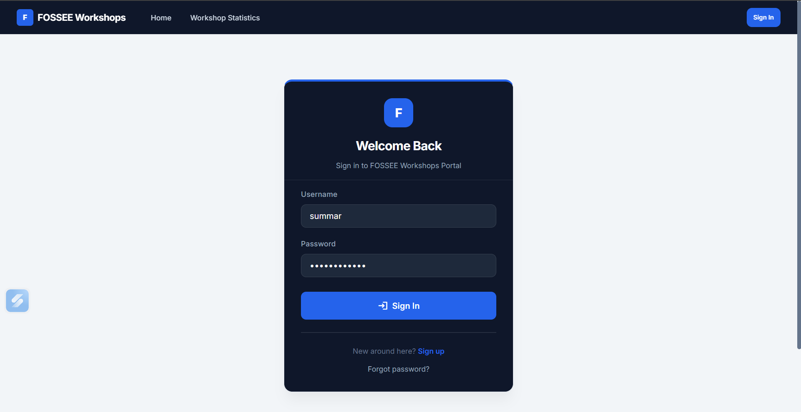

# Python Screening Task : UI/UX Enhancement 
## Overview


This project focuses on improving the UI/UX of the existing Workshop Booking platform provided by FOSSEE. The goal was to enhance usability, responsiveness, and overall visual design while keeping the core functionality unchanged.

The redesign mainly emphasizes better clarity, accessibility, and a more modern user experience. Extra attention was given to improving navigation flow and reducing visual clutter so that users can complete tasks more easily. The interface was also optimized for mobile users to ensure a smooth and consistent experience across devices.

---

## Technical Reasoning & Implementation Details

### What design principles guided your improvements?

The main principle followed was separation, where the backend (Django) and frontend (React) are clearly separated. This makes the application easier to maintain and allows independent development of both parts without tightly coupling logic and UI.

On the UI side, the focus was on keeping the design clean, minimal, and intuitive while also making components reusable. This helps reduce redundancy and keeps the codebase more organized. Tailwind CSS was used to maintain consistency in terms of colors, typography, and spacing. It also helped in quickly building a uniform design system, making the overall interface more cohesive and easier to scale.

---
### How did you ensure responsiveness across devices?

Responsiveness was achieved by designing flexible layouts that can adapt to different screen sizes rather than creating fixed designs. Components were structured in a way that they can stack, resize, or rearrange themselves depending on the available screen space.

Tailwind CSS utility classes were used extensively to control spacing, sizing, and alignment dynamically. Instead of writing custom media queries, built-in responsive utilities helped adjust font sizes, margins, paddings, and layouts for different devices. 

Additionally, attention was given to elements like navigation, forms, and cards to ensure they remain usable on smaller screens. For example, multi-column layouts were converted into single-column layouts on mobile, and touch-friendly spacing was maintained to improve usability.

---

### What trade-offs did you make between the design and performance?

The project uses client-side rendering (CSR) with React and Vite. This approach increases the initial load time slightly because the browser needs to download and process JavaScript files.

However, once the application is loaded, navigation becomes much faster and smoother since there are no full page reloads. This results in a better and more interactive user experience, which was prioritized over the slightly slower initial load.

---

### What was the most challenging part of the task and how did you approach it?

The most challenging part was decoupling the existing Django setup, especially handling things like authentication and context data, and converting them into REST APIs.

To tackle this, the backend was handled step by step. First, Django REST Framework (DRF) was set up, and APIs were created and tested individually using serializers to ensure correct data handling. Then, CORS was configured to allow communication between the frontend and backend. Finally, these APIs were integrated with the React frontend carefully, ensuring proper data flow and handling of authentication. Breaking the problem into smaller steps made the process easier to manage and debug.

---
## Before and After Screenshots

**Home Before:**  


**Home After:**  


**Workshop Statistics Before:**  


**Workshop Statistics After:**  


**Login Page Responsiveness:**


**Login Page Responsiveness:**

---

## Setup Instructions

This project is divided into two distinct applications: a Django Backend API and a React Frontend. You will need two terminals running simultaneously to start the project.

### 1. Backend Setup (Django)
Navigate to the root directory of the project.

```bash
# 1. Create and activate a virtual environment 
python -m venv venv
# On Windows:
venv\Scripts\activate
# On Mac/Linux:
# source venv/bin/activate

# 2. Install dependencies
pip install -r requirements.txt

# 3. Apply database migrations
python manage.py migrate

# 4. Start the backend development server
python manage.py runserver
```

### 2. Frontend Setup (React / Vite)
Open a new terminal and navigate to the `frontend` folder.

```bash
# 1. Move to the frontend directory
cd frontend

# 2. Install node module dependencies
npm install

# 3. Start the Vite development server
npm run dev
```

Your React frontend will typically run on `http://localhost:5173` and communicate with the Django backend running on `http://localhost:8000`.

---
__NOTE__: Check `docs/Getting_Started.md` for more historical info on the backend architecture.

## Student Details

Name: Summar Porwal

Institution Name: VIT Bhopal


Email Id: summarporwal22@gmail.com


College Email Id: summar.23bce11378@vitbhopal.ac.in


Repository link: *https://github.com/summar22/workshop_booking.git*

---